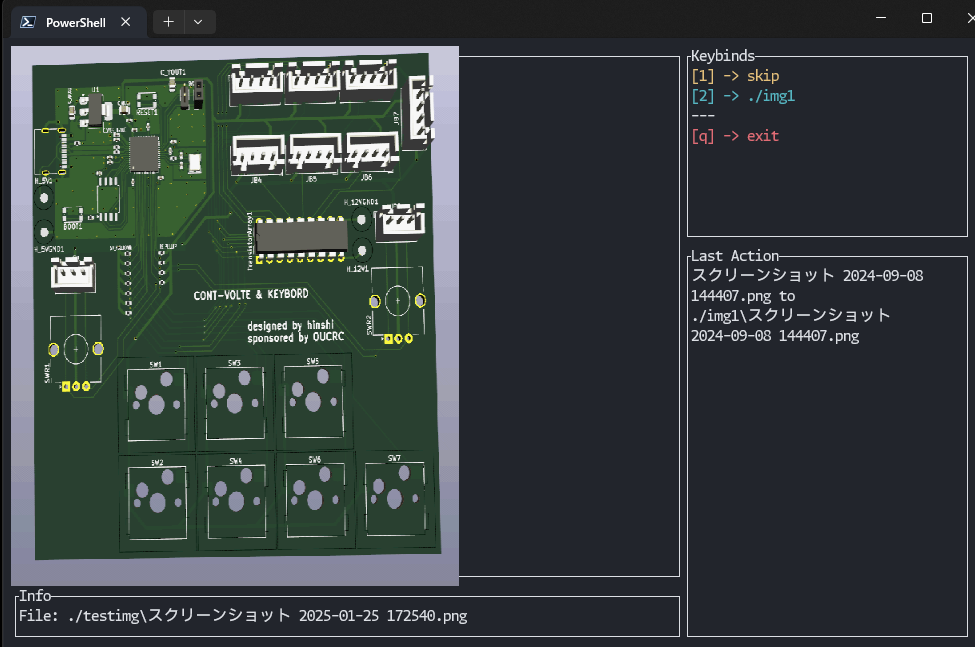

# shotclassif

## 概要



shotclassifはTUIでの画像整理ツールです．

キーボードショートカットを用いて高速に画像を複数のフォルダに分類することができます．

## 使い方

### インストール

#### バイナリを利用 (Windowsのみ)

Releaseページから最新版の.exeファイルをダウンロードしてください．


#### コードからビルド

ソースコードからビルドするにはRustツールチェーンが必要です．

```
git clone https://github.com/hinshiba/shotclassif.git
cd shotclassif
cargo build --release
```

### 実行

`config.toml`という名前で設定ファイルを作成してください．
```toml
# 分類したい画像が格納されているディレクトリ
dir = "C:/Users/YourUser/Pictures/Unsorted"

# キーと分類先ディレクトリのマッピング
[dests]
# "a"キーを押すと"hoge/huga"に移動
"a" = "hoge/huga"
# "b"キーを押すと "./temp" に移動
"b" = "./temp"
# 移動先に"skip"を指定すると移動せずにスキップします
"s" = "skip"
# "q"キーは終了キーと被るので設定しないでください
# "q" = "not work"
```

`shotclassif.exe "path\to\config.toml"`をターミナルで実行してください．

`shotclassif.exe`と同じディレクトリに`config.toml`がある場合はパスを指定する必要はありません．

`q`キーで終了します．

移動先に同名のファイルが存在する場合は，上書きを避けるため移動されません．

### Tips

カレントディレクトリを操作対象にするには，`dir = "./"`としましょう．

## Todo

- Undo機能の実装
- より高速な画像表示

## ライセンス

MIT License

(C) 2025 hinshiba

[LICENSE](LICENSE)

## 変更履歴

### v0.2.1 2025-06-21

- -vコマンドで古いバージョンが表示される不具合を修正
- その他プログラムのファイル分割

### v0.2.0 2025-06-19

- 画像の読み込みやデコードを別スレッドで行うように
- config.tomlの場所をコマンドライン引数で指定できるように
- カレントディレクトリの操作についてreadme.mdを追記
- 先頭のsを小文字に